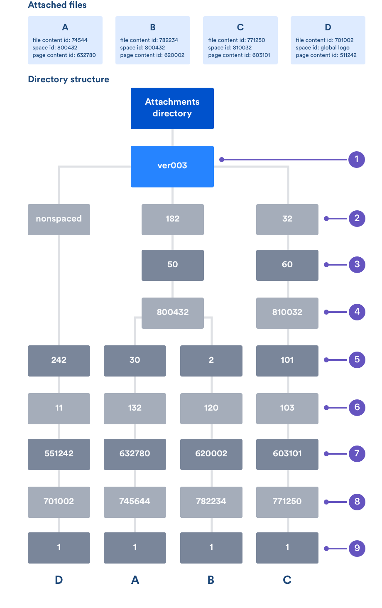
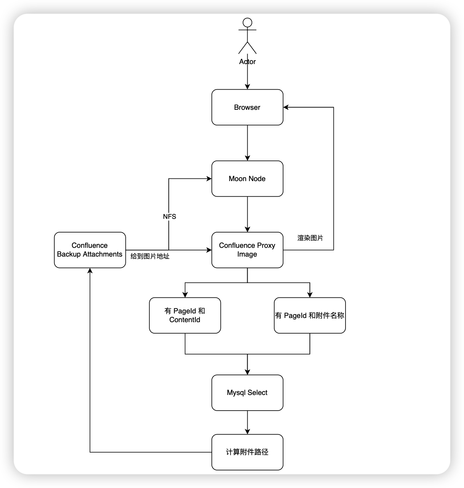

## 介绍

接收到一个业务需求，也就是当我在写 Confluence 文档的时候，经常遇到直接复制内容到其他平台的情况。那么这个时候如果我当前的内容里面带有图片，并且页面还有权限，那么就会出现在我其他页面访问的时候，这个图片内容粘贴过去的时候就是裂图，因为没有权限可以看

## 先了解下 Confluence 的附件设计

Confluence 的附件有一个数字用来定义属性：文件自己的内容 id 和 文件所在页面中的内容 id 。这个意思是文件在逻辑上是属于内容的，通常内容又是属于空间（不是所有的内容都属于空间）。Confluence 中的空间文件，目录结构通常有 8 个级别，每一个目录级别的名字通常基于下面的算法。  

|层级|详解|
|---|---|
|1 (top) | 总是为 'ver003' 这个定义为 Confluence 版本 3 的文件存储格式|
|2|最小的 3 个数字，这个数字为 空间 id 取模 250|
|3|下一个最小的 3 个数字，这个数字为 空间 id 取模 250|
|4|完整的 空间 id|
|5|附件所附加在页面的 ID 取模 250 后的最小 3 个数字|
|6|附件所附加在页面的 ID 取模 250 后的下一个最小 3 个数字|
|7|附件所在页面的完整的 content id|
|8|附件所在完整的 content id|
|9|这个是文件，这个文件是按照版本号进行命名的，例如：1, 2, 6。|



## 开始撸代码

### 逻辑图



### 前置条件

在计算路径前，需要知道一下信息
- 页面 PageID
- 空间的 SpaceID
- 附件的 ContentID

### 附件路径计算方法

```Golang
func confluencePath(pageId string, spaceId string, contentId string) string {
	attachmentPath := "ver003"

	for i := len(spaceId); i >= 0; i -= 3 {
		start := i - 3
		if start < 0 {
			start = 0
		}
		substr := spaceId[start:i]
		result := modulo(substr, 250)
		attachmentPath = attachmentPath + "/" + fmt.Sprintf("%d", result)
		if start == len(spaceId)-6 {
			attachmentPath = attachmentPath + "/" + spaceId
			break
		}
	}

	for i := len(pageId); i >= 0; i -= 3 {
		start := i - 3
		if start < 0 {
			start = 0
		}
		substr := pageId[start:i]
		result := modulo(substr, 250)
		attachmentPath = attachmentPath + "/" + fmt.Sprintf("%d", result)
		if start == len(pageId)-6 {
			attachmentPath = attachmentPath + "/" + pageId
			break
		}
	}
	return attachmentPath + "/" + contentId + "/1"
}

func modulo(substr string, module int) int {
	num := 0
	for _, ch := range substr {
		num = num*10 + int(ch-'0')
		num %= module
	}
	return num
}
```

### 处理复制出来的格式

由于每个人复制的方式不同，可能造成附件的地址不同，因此需要做成可配置项，目前已知的是这几种
- pages/viewpage\.action\?pageId=(\d+)&preview=/(\d+)/(\d+)/([^&]+)
- download/attachments/(\d+)/([^?]+)
- download/thumbnails/(\d+)/([^?]+)

```Golang
for _, value := range config.URLPatterns {
		// 编译正则表达式
		re := regexp.MustCompile(value.Info.Pattern)
		// 匹配正则表达式
		matches := re.FindStringSubmatch(urlPath)
		var confluenceContent ConfluenceContent
		if len(matches) > value.Info.Fields.ContentId && len(matches) > value.Info.Fields.PageId {
			confluenceContent = query(value.Info.Fields.Type, matches[value.Info.Fields.ContentId], matches[value.Info.Fields.PageId])
			confluenceAttachmentPath := confluencePath(confluenceContent.PAGEID, confluenceContent.SPACEID, confluenceContent.CONTENTID)
			if len(confluenceAttachmentPath) < 20 {
				http.Error(w, "地址不正确", http.StatusBadRequest)
				return
			} else {
				imageRender(w, r, config.SourceBegin+confluenceAttachmentPath)
				return
			}
		}
	}
```

### 通过 ContentId 和附件名称获取计算需要的信息

```Golang
func query(values ...interface{}) ConfluenceContent {
	if len(values) < 2 {
		return ConfluenceContent{}
	}
	var runSql string
	if values[0] == "title" && values[1] != nil && values[2] != nil {
		runSql = fmt.Sprintf("SELECT `CONTENTID`,`TITLE`,`PAGEID`,`SPACEID` FROM CONTENT WHERE `CONTENTTYPE` = 'ATTACHMENT' AND `TITLE` = '%s' AND `PAGEID` = '%s'", values[1], values[2])
	}
	if values[0] == "contentId" && values[1] != nil && values[2] != nil {
		runSql = fmt.Sprintf("SELECT `CONTENTID`,`TITLE`,`PAGEID`,`SPACEID` FROM CONTENT WHERE `CONTENTTYPE` = 'ATTACHMENT' AND `CONTENTID` = '%s' AND `PAGEID` = '%s'", values[1], values[2])
	}
	if len(runSql) > 0 {
		rows, err := database.DB.Query(runSql)
		if err != nil {
			panic(err.Error())
		}
		defer rows.Close()

		// Iterate through the results
		for rows.Next() {
			var confluenceContent ConfluenceContent
			if err := rows.Scan(&confluenceContent.CONTENTID, &confluenceContent.TITLE, &confluenceContent.PAGEID, &confluenceContent.SPACEID); err != nil {
				panic(err.Error())
			}
			return confluenceContent
		}

		if err = rows.Err(); err != nil {
			panic(err.Error())
		}
	}
	return ConfluenceContent{}
}
```

## 完结

有了这信息，后面的就是 HTTP 的处理了，完整的案例代码在下方：  
GitHub: [点击直达](https://github.com/almightyYantao/Confluence-Proxy-Image)