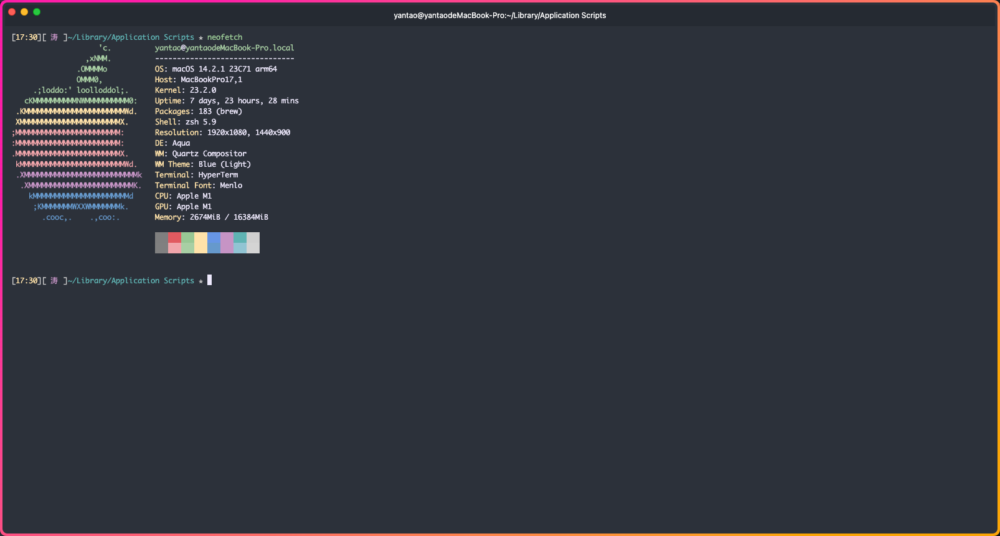
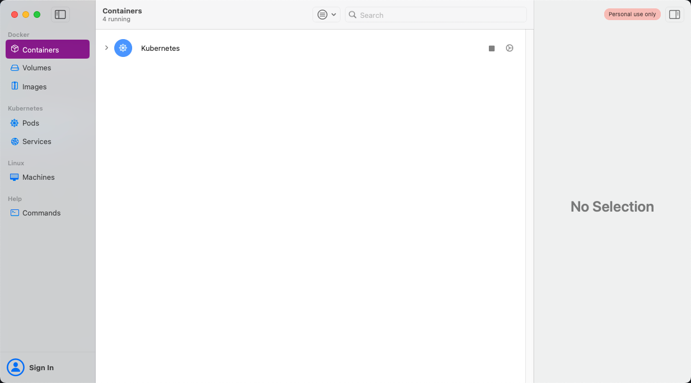

## 背景

提到 Mac 大家想到的应该就是工作机、生产力工具，但我们刚刚接触 MacOS 时我们很难适应，就算适应了以后也会发现有很多不方便的地方，今天就给大家推荐一些提高 Mac 使用效率的软件

## 软件推荐

### Hyper

Hyper 是一个开源的终端工具，样式非常好看，虽然现在支持的插件少了点，但是还是有非常的优化空间的。

[官网](https://hyper.is/)

### OrbStack

OrbStack 是运行 Docker 容器和 Linux 的快速、轻便且简单的方法。 Docker Desktop 替代方案以光速进行开发。Say goodbye to slow, clunky containers and VMs

[官网](https://orbstack.dev/)

在这个云原生时代，大部份开发者都离不开 Docker，容器化技术终结了之前程序员配了一个下午的环境只为打出一句 Hello World 的时代，无论多复杂的环境，直接 pull 下来就可以直接 run，加上微服务的广泛使用，容器技术确确实实给开发者带来了好处。
官方的 Docker Compose 非常耗费系统资源，即便是 MacBook Pro M1 pro + 16g ram, 运行 2～3个 容器， 系统也会非常卡顿，苹果的内存又比金子还贵😠，于是出现了完美替代品 - OrbStack。OrbStack 对 CPU 和磁盘的使用率低，对内存的需求少，而且是一款原生的 Swift 应用程序，可以无缝运行 Docker 容器和完整的 Linux 发行版，并提供强大的网络功能。个人可以完全免费使用！
