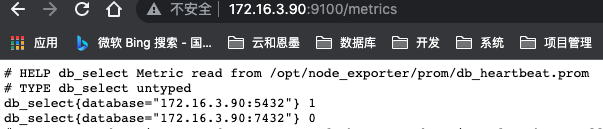

## 概述

`node_exporter`除了可以收集系统指标外，还可以采集我们自定义的监控指标。采集自定义监控指标是通过textfile模块来完成的，textfile模块默认会随着`node_exporter`启动而启动，如果想要采集自定义指标，还需要在启动`node_exporter`的时候，添加–collector.textfile.directory=""参数，这个参数是自定义的采集路径，所有自定义监控指标文件都放在这个目录下，且文件名都以.prom结尾。

## 自定义指标

### 启动node_exporter

```shell
--创建目录
# mkdir -p /opt/node_exporter/prom

--以指定采集路径的方式启动
# nohup /opt/node_exporter/node_exporter --collector.textfile.directory="/opt/node_exporter
```

### 创建监控指标文件

```shell
# cd /opt/node_exporter/prom
# vi db_heartbeat.prom

--HELP 和 TYPE 如果没有制定，node_exporter会自动添加
# HELP db_select Metric read from /opt/node_exporter/prom/db_heartbeat.prom
# TYPE db_select untyped
db_select{database="172.16.3.90:5432"} 1
db_select{database="172.16.3.90:7432"} 0
```

在浏览器中可以看到，我们自定义的指标已经采集到


## 定时任务

自定义监控指标大多数需要与crontab结合，按着需求设置采集指标的时间。

### flock命令

为了防止某个任务的执行时间超过了 crontab 中为此任务设定的执行周期，使用flock命令将crontab串行化:
`flock -xn /tmp/flock.lock -c 'xxx.sh'` --如果/tmp/flock.lock不存在，flock会自动创建

```shell
Usage:
 flock [options] <file|directory> <command> [command args]
 flock [options] <file|directory> -c <command>
 flock [options] <file descriptor number>

Options:
 -s  --shared             get a shared lock
 -x  --exclusive          get an exclusive lock (default)
 -u  --unlock             remove a lock
 -n  --nonblock           fail rather than wait
 -w  --timeout <secs>     wait for a limited amount of time
 -E  --conflict-exit-code <number>  exit code after conflict or timeout
 -o  --close              close file descriptor before running command
 -c  --command <command>  run a single command string through the shell

 -h, --help     display this help and exit
 -V, --version  output version information and exit

For more details see flock(1).
```

### MogDB 探活脚本

通过sql（select 1;）进行探活

```shell
vi /opt/scripts/db_heartbeat.sh

#!/bin/bash

source /home/omm/.bashrc

nums=(
172.16.3.90:5432:opengauss_exporter:opengauss_exporter123
172.16.3.90:7432:opengauss_exporter:opengauss_exporter123
)

for i in $(seq 0 $[${#nums[*]}-1])
do
  ip=`echo ${nums[$i]}|awk -F ':' '{print $1}'`
  port=`echo ${nums[$i]}|awk -F ':' '{print $2}'`
  username=`echo ${nums[$i]}|awk -F ':' '{print $3}'`
  password=`echo ${nums[$i]}|awk -F ':' '{print $4}'`

  result=`gsql "host=$ip port=$port user=$username password=$password dbname=postgres" -t -c "select 1"`
  if [ $? -eq 0 ]; then
     echo "db_select{database=\"$ip:$port\"} 1" >> /opt/node_exporter/prom/db_heartbeat.prom
  else
     echo "db_select{database=\"$ip:$port\"} 0" >> /opt/node_exporter/prom/db_heartbeat.prom
  fi
done
```

### crontab

```shell
--执行脚本之前，先清理.prom文件，防止监控指标重复
*/10 * * * * /usr/bin/flock -xn /tmp/flock.lock -c ">/opt/node_exporter/prom/db_heartbeat.prom && /usr/bin/bash /opt/scripts/db_heartbeat.sh >> /opt/scripts/db_heartbeat.log"
```
