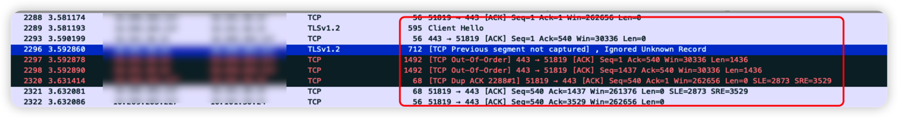
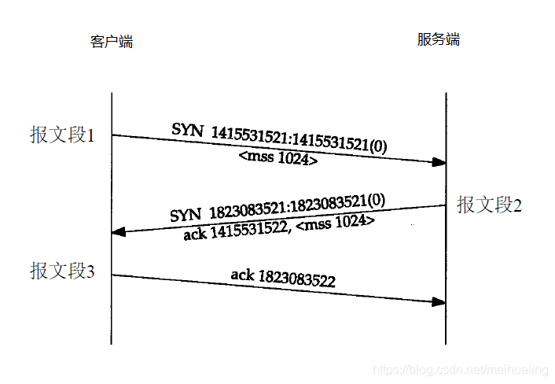
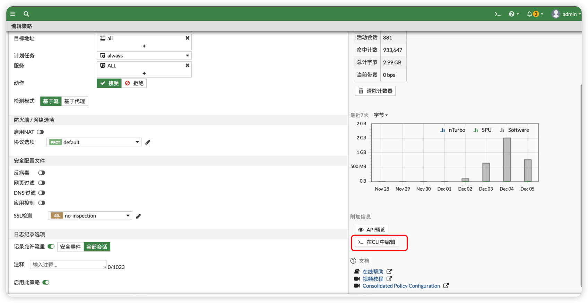

## 背景

在做切割的时候，将原来的AR路由器换成了飞塔的 FortiGate 作为出口。在做完切割后正式上线的时候发现一个问题，外区通过 GRE 隧道连接进来内网的时候，部分网站可以访问，但是部分网站就是 timeout，偶尔一下可以正常。通过 ping 和路由追踪一切都是正常，ping包也正常。那么就奇怪了～这问题还是第一次见！！！

## 调试抓包


通过这张图可以看到包都是正常转发了，Client Hello 都出来了。这时候我们先不看问题，先来了解下 `MTU`和`TCP MSS`

### 路径MTU（PMTU）

一种动态发现因特网上任意一条路径的最大传输单元(MTU)的技术。它对这条路径上由路由器产生的ICMP消息作了小的修改。如果在路径上的路由器没有作出修改，有作出修改，这种技术就不能发现正确的路径MTU，但是这种技术选出的MTU将和使用其它方法选出的MTU同样准确，甚至在许多情况下更加精确。

### TCP MSS

MSS（Maximum Segment Size，最大报文长度），是TCP协议定义的一个选项，MSS选项用于在TCP连接建立时，收发双方协商通信时每一个报文段所能承载的最大数据长度  
一旦DF位置一，(DF位为1的话则不允许分片）将不允许中间设备对该报文进行分片，那么在遇到IP报文长度超过中间设备转发接口的MTU值时，该IP报文将会被中间设备丢弃。在丢弃之后，中间设备会向发送方发送ICMP差错报文。

### TCP建立的3次握手过程

这里借用一张网图：


## 什么是 MSS 限制？

有时，网络路径上的路由器设置的 MTU 值低于典型的 1,500 字节。这可能会导致数据包丢失并且很难被发现。

为了确保数据包在这种情况下仍能到达目的地，一种选择是减少传入数据包有效负载的大小。这可以通过配置服务器以应用 MSS 限制来实现：在 TCP 握手期间，服务器可以向 MSS 发送它愿意接收的数据包的信号，“限制”来自其他服务器的最大有效负载大小。例如，如果服务器 A 和 B 正在建立 TCP 连接，并且服务器 B 通信的 MSS 为 1,436 字节，则服务器 A 将在连接期间发送最大有效负载大小为 1,436 字节的数据包。

MSS 限制的另一个应用是在 GRE 隧道的情况下，将 24 字节的标头添加到原始数据包中，以便将其发送到新的目的地。如果原始数据包大于 1,476 字节，这可能会使新数据包超过典型的 1,500 字节 MTU；即使在应用了 GRE 标头之后，也可以应用 MSS 限制来要求传入数据包小于 1,500 字节。

## GRE

### GRE 标头中包含什么？

通过网络发送的所有数据都被分解为较小的部分，称为数据包，所有数据包都包括两部分：有效负载和标头。有效负载是数据包的实际内容，即正被发送的数据。标头包含有关数据包来自何处以及它属于哪个数据包组的信息。每种网络协议都会将标头附加到每个数据包上。

GRE 向每个数据包添加两个标头：GRE 标头（4 个字节长）和 IP 标头（20 个字节长）。GRE 标头表明封装数据包所使用的协议类型。IP 标头封装了原始数据包的标头和有效负载。这意味着 GRE 数据包通常包含两个 IP 标头：一个用于原始数据包，另一个由 GRE 协议添加。仅 GRE 隧道两端的路由器将引用原始的、非 GRE IP 标头。

### GRE 的使用如何影响 MTU 和 MSS 要求？

MTU 和 MSS 是用来限制通过网络传输的数据包最大长度的度量单位，就像对过桥车辆限重一样。MTU 测量数据包的总大小，包括标头；MSS仅测量有效负载。超过 MTU 值的数据包将被分成几段或分解成较小的数据包，使之适合在网络上传输。

像任何协议一样，使用 GRE 会在数据包原有大小基础上增加几个字节。在数据包的 MSS 和 MTU 设置中必须考虑这个因素。如果 MTU 设为 1,500 字节，MSS 设为 1,460 字节（考虑到必要的 IP 和 TCP 标头大小），则增加 GRE 24字节标头将导致数据包超过 MTU 限值：

1,460 字节 [有效负载] + 20 字节 [TCP 标头] + 20 字节 [IP 标头] + 24 字节 [GRE 标头+ IP 标头] = 1,524字节

因此，数据包将被分段。分段会减慢数据包传递，并增加算力开销，因为超出 MTU 的数据包必须分解然后重新组合。

通过减少 MSS 长度以包含 GRE 标头，可以避免这种情况。如果将 MSS 设置为 1,436 而不是 1,460，那么，GRE 标头的问题就得到了解决，并且数据包不会超过 MTU 值 1,500：

1,436 字节 [有效负载] + 20 字节 [TCP 标头] + 20 字节 [IP 标头] + 24 字节 [GRE 标头+ IP 标头] = 1,500 字节

尽管避免了分段，但结果却是有效载荷变小，这意味着需要额外的数据包来传递数据。例如，如果目标是传递 150,000 字节的内容（或大约 150 kB），假设 MTU 设置为 1,500，且未使用其他 3 层协议，那么，比较一下使用 GRE 和不使用 GRE 时分别需要多少个数据包：

不使用 GRE，MSS 为 1,460： 103 个数据包
使用 GRE，MSS 为 1,436： 105 个数据包
额外的两个数据包会增加毫秒级的数据传输延迟。但是，使用 GRE 比不使用 GRE 可以使这些数据包选择更快的网络路径，进而可以弥补损失的时间。

## 解决

看了这么多的理论概念，其实解决起来就是调小 mss 。那么就开始操作吧～

### 测试最大mss

```bash
ping -f 内网地址 -l 1436
```

这个是我后面已经调整完成后的截图，可以看到现在醉倒就是 1472 ，当然实际出现问题的时候，比这个值要更小一点


### 调整飞塔策略的 mss

找到需要调整的策略


点击->`在 Cli 中编辑`


调小 mss 即可

```bash
config firewall policy
    edit 12
        set name "HZ_TO_CD"
        set uuid 6a86073a-90fc-51ee-5e3e-97fce1190d71
        set srcintf "Vlan104"
        set dstintf "GRE_CD"
        set action accept
        set srcaddr "all"
        set dstaddr "all"
        set schedule "always"
        set service "ALL"
        set logtraffic all
        set tcp-mss-sender 1400
        set tcp-mss-receiver 1400
    next
end
```
