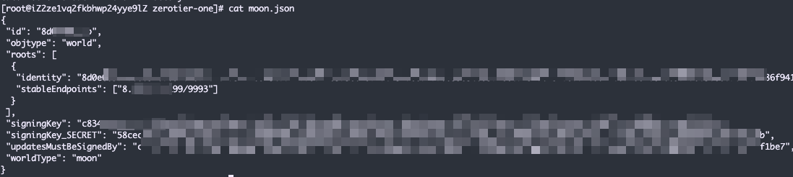
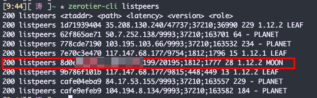
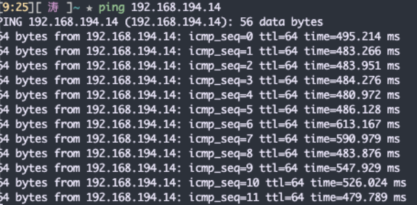
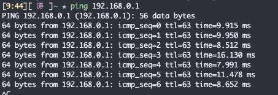

## 背景

最近老是出现奇怪的情况，家里的主机总是连不上，公司和笔记本都没问题，但是家里的经常出现开机以后要等很久很久，zerotier才能ping通，然后中间可能还会又ping不通了，只要ping不通基本rdp就连不上。

怀疑可能是zerotier从国外打洞失败了，可能某个ip被墙了，但是平常看不出来，而ZeroTier可以自建服务器，加速p2p的访问，就想着试一试。

看了一些评论说，有些运营商好像直接ban了zerotier的服务器，导致永久无法连接，但是如果使用moon中转的话，就没这个问题了。

## Zerotier 关键角色介绍

`PLANET` 行星服务器，Zerotier 各地的根服务器，有日本、新加坡等地

`moon` 卫星级服务器，用户自建的私有根服务器，起到中转加速的作用

`LEAF` 相当于各个枝叶，就是每台连接到该网络的机器节点。

## 安装教程

### 服务器安装Zerotier

```bash
curl -s https://install.zerotier.com/ | sudo bash
```

### 确认是否安装成功

```bash
[root@VM-12-13-centos ~]# zerotier-cli info
200 info eb444ec0d8 1.10.2 ONLINE
```

### 将vps加入到zerotier中，加入成功以后，去官网授权

```bash
zerotier-cli join 你创建的网络分配的id
```

### 创建moon

#### 创建Moon配置文件

```bash
zerotier-idtool initmoon identity.public > moon.json
```

#### 修改公网IP地址

只要修改 `stableEndpoints` 就可以了，其他的不变，这里填写你服务器的公网IP，`9993`是默认的UDP端口，记得打开防火墙或者安全组

```bash
...
"stableEndpoints": ["xxx.xxx.xxx.xxx/9993"]
...
```



#### 生成moon文件

```bash
zerotier-idtool genmoon moon.json
```

#### 移动moon文件

```bash
mkdir /var/lib/zerotier-one/moons.d
mv 000000xxxxxx.moon /var/lib/zerotier-one/moons.d
```

#### 重启Service

```bash
service zerotier-one restart
```

### 客户端加入moon

这里的 `xxxxxx` 替换成你自己的上面生成的moon文件的`000`后面的字符串，也可以直接看`moon.json`里面的`id`

```bash
zerotier-cli orbit xxxxxxx xxxxxx
```

### 查看是否加入成功

```bash
zerotier-cli listpeers
```

加入后最好重新连接下Network，并且等待一会，就会正常，我一开始加入后延迟还是很高。等了一会就全部正常了



## 前后对比

  

