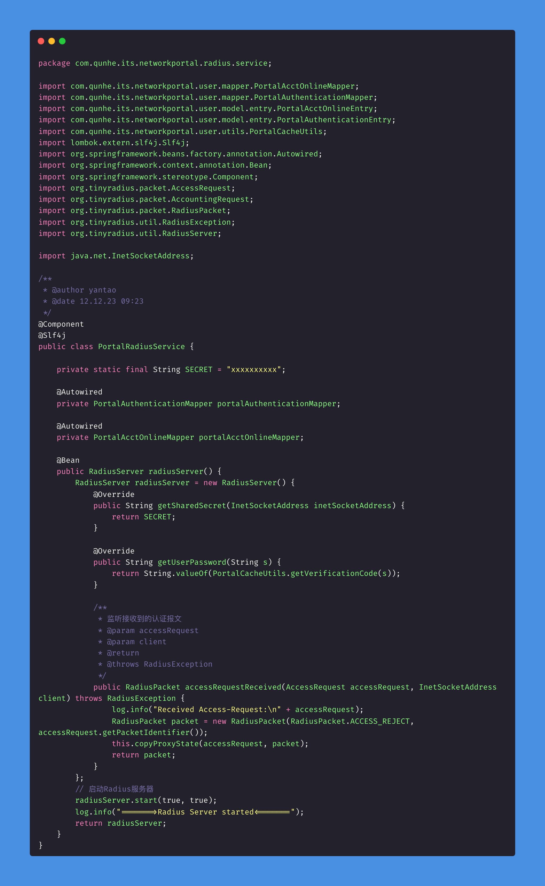
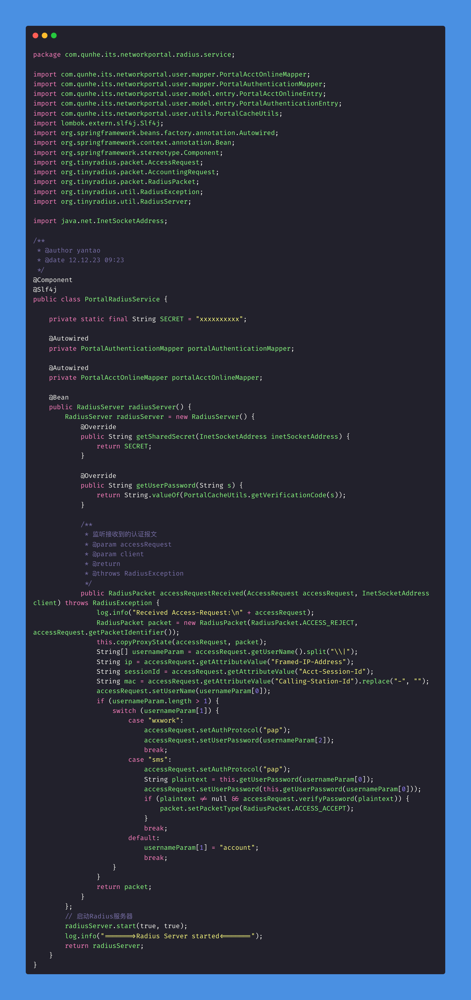
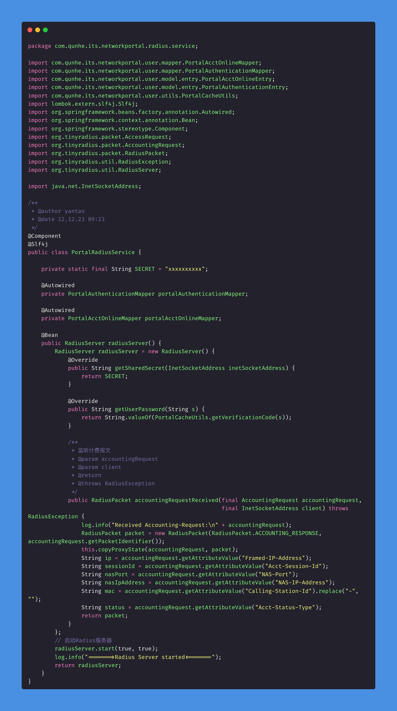
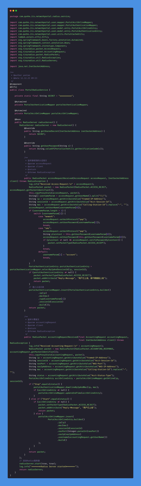

## Radius 认证

RADIUS（Remote Authentication Dial-In User Service）是一种用于进行远程用户身份验证和授权的网络协议。它最初是为拨号用户进行身份验证和授权而设计的，但后来被广泛用于其他网络访问服务，如无线局域网（Wi-Fi）、虚拟专用网络（VPN）等。

RADIUS工作在客户端-服务器模型下，其中网络设备（如路由器、交换机、接入服务器等）充当RADIUS客户端，而RADIUS服务器则负责验证用户的身份和授权用户的访问。通常，用户试图访问网络时，网络设备会向RADIUS服务器发送身份验证请求，并根据RADIUS服务器的响应来决定是否允许或拒绝用户的访问。

## Radius核心功能

- 身份验证（Authentication）： 验证用户的身份，确保用户是合法用户。
- 授权（Authorization）： 根据用户的身份和其他属性，授权用户访问特定的网络资源。
- 记帐（Accounting）： 记录用户的网络使用情况，包括登录和注销时间、使用的服务等。

RADIUS协议采用了一种简单而有效的文本格式进行通信，通常运行在UDP协议之上。由于其灵活性和可扩展性，RADIUS已成为许多网络服务提供商和企业网络中的标准身份验证和授权协议。

## 基于 tinyradius 实现 Raidus 认证

### 基础认证



### 短信认证



### 计费



## 完整案例代码



```Java
package com.qunhe.its.networkportal.radius.service;

import com.qunhe.its.networkportal.user.mapper.PortalAcctOnlineMapper;
import com.qunhe.its.networkportal.user.mapper.PortalAuthenticationMapper;
import com.qunhe.its.networkportal.user.model.entry.PortalAcctOnlineEntry;
import com.qunhe.its.networkportal.user.model.entry.PortalAuthenticationEntry;
import com.qunhe.its.networkportal.user.utils.PortalCacheUtils;
import lombok.extern.slf4j.Slf4j;
import org.springframework.beans.factory.annotation.Autowired;
import org.springframework.context.annotation.Bean;
import org.springframework.stereotype.Component;
import org.tinyradius.packet.AccessRequest;
import org.tinyradius.packet.AccountingRequest;
import org.tinyradius.packet.RadiusPacket;
import org.tinyradius.util.RadiusException;
import org.tinyradius.util.RadiusServer;

import java.net.InetSocketAddress;

/**
 * @author yantao
 * @date 12.12.23 09:23
 */
@Component
@Slf4j
public class PortalRadiusService {

    private static final String SECRET = "xxxxxxxxxx";

    @Autowired
    private PortalAuthenticationMapper portalAuthenticationMapper;

    @Autowired
    private PortalAcctOnlineMapper portalAcctOnlineMapper;

    @Bean
    public RadiusServer radiusServer() {
        RadiusServer radiusServer = new RadiusServer() {
            @Override
            public String getSharedSecret(InetSocketAddress inetSocketAddress) {
                return SECRET;
            }

            @Override
            public String getUserPassword(String s) {
                return String.valueOf(PortalCacheUtils.getVerificationCode(s));
            }

            /**
             * 监听接收到的认证报文
             * @param accessRequest
             * @param client
             * @return
             * @throws RadiusException
             */
            public RadiusPacket accessRequestReceived(AccessRequest accessRequest, InetSocketAddress client) throws RadiusException {
                log.info("Received Access-Request:\n" + accessRequest);
                RadiusPacket packet = new RadiusPacket(RadiusPacket.ACCESS_REJECT, accessRequest.getPacketIdentifier());
                this.copyProxyState(accessRequest, packet);
                String[] usernameParam = accessRequest.getUserName().split("\\|");
                String ip = accessRequest.getAttributeValue("Framed-IP-Address");
                String sessionId = accessRequest.getAttributeValue("Acct-Session-Id");
                String mac = accessRequest.getAttributeValue("Calling-Station-Id").replace("-", "");
                accessRequest.setUserName(usernameParam[0]);
                if (usernameParam.length > 1) {
                    switch (usernameParam[1]) {
                        case "wxwork":
                            accessRequest.setAuthProtocol("pap");
                            accessRequest.setUserPassword(usernameParam[2]);
                            break;
                        case "sms":
                            accessRequest.setAuthProtocol("pap");
                            String plaintext = this.getUserPassword(usernameParam[0]);
                            accessRequest.setUserPassword(this.getUserPassword(usernameParam[0]));
                            if (plaintext != null && accessRequest.verifyPassword(plaintext)) {
                                packet.setPacketType(RadiusPacket.ACCESS_ACCEPT);
                            }
                            break;
                        default:
                            usernameParam[1] = "account";
                            break;
                    }
                }
                PortalAuthenticationEntry portalAuthenticationEntry = portalAuthenticationMapper.selectByIpAndSessionId(ip, sessionId);
                if (portalAuthenticationEntry != null) {
                    packet.setPacketType(RadiusPacket.ACCESS_REJECT);
                    packet.addAttribute("Reply-Message", "用户已上线，请不要重复上线");
                    return packet;
                }
                // 插入认证记录
                portalAuthenticationMapper.insert(PortalAuthenticationEntry.builder()
                        .ip(ip)
                        .mac(mac)
                        .type(usernameParam[1])
                        .sessionId(sessionId)
                        .build());
                return packet;
            }

            /**
             * 监听计费报文
             * @param accountingRequest
             * @param client
             * @return
             * @throws RadiusException
             */
            public RadiusPacket accountingRequestReceived(final AccountingRequest accountingRequest,
                                                          final InetSocketAddress client) throws RadiusException {
                log.info("Received Accounting-Request:\n" + accountingRequest);
                RadiusPacket packet = new RadiusPacket(RadiusPacket.ACCOUNTING_RESPONSE, accountingRequest.getPacketIdentifier());
                this.copyProxyState(accountingRequest, packet);
                String ip = accountingRequest.getAttributeValue("Framed-IP-Address");
                String sessionId = accountingRequest.getAttributeValue("Acct-Session-Id");
                String nasPort = accountingRequest.getAttributeValue("NAS-Port");
                String nasIpAddress = accountingRequest.getAttributeValue("NAS-IP-Address");
                String mac = accountingRequest.getAttributeValue("Calling-Station-Id").replace("-", "");
                String status = accountingRequest.getAttributeValue("Acct-Status-Type");
                PortalAcctOnlineEntry acctOnlineEntry = portalAcctOnlineMapper.getOnline(ip, sessionId);
                if ("Stop".equals(status)) {
                    portalAuthenticationMapper.downlineByIpAndMac(ip, mac);
                    if (acctOnlineEntry != null) {
                        portalAcctOnlineMapper.updateEndTime(acctOnlineEntry);
                    }
                } else if ("Start".equals(status)) {
                    if (acctOnlineEntry != null) {
                        packet.setPacketType(RadiusPacket.ACCESS_REJECT);
                        packet.addAttribute("Reply-Message", "用户已上线");
                        return packet;
                    } else {
                        portalAcctOnlineMapper.insert(
                                PortalAcctOnlineEntry.builder()
                                        .ip(ip)
                                        .mac(mac)
                                        .sessionId(sessionId)
                                        .nasPort(Integer.parseInt(nasPort))
                                        .nasIp(nasIpAddress)
                                        .username(accountingRequest.getUserName())
                                        .build()
                        );
                    }
                }
                return packet;
            }
        };
        // 启动Radius服务器
        radiusServer.start(true, true);
        log.info("=======>Radius Server started<=======");
        return radiusServer;
    }
}

```