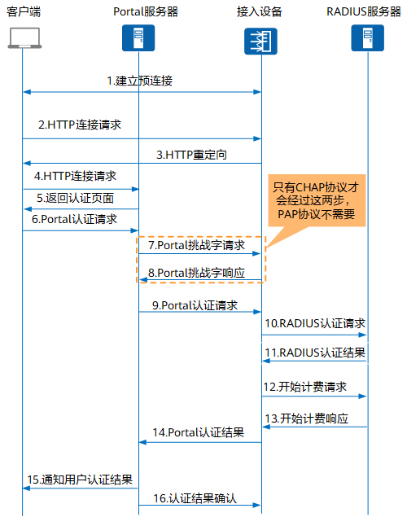

## 什么是 Portal？

Portal认证通常也称为Web认证，一般将Portal认证网站称为门户网站。用户上网时，必须在门户网站进行认证，如果未认证成功，仅可以访问特定的网络资源，认证成功后，才可以访问其他网络资源。

### 优点

- 一般情况下，客户端不需要安装额外的软件，直接在Web页面上认证，简单方便。
- 便于运营，可以在Portal页面上进行业务拓展，如广告推送、企业宣传等。
- 技术成熟，被广泛应用于运营商、连锁快餐、酒店、学校等网络。
- 部署位置灵活，可以在接入层或关键数据的入口作访问控制。
- 用户管理灵活，可基于用户名与VLAN/IP地址/MAC地址的组合对用户进行认证。

## Portal认证系统组网图

## Wi-Fi认证的机制和原理

每当设备连接wifi后，系统会自动做一个连通性校验，此校验的本质是发送一个HTTP请求。如果请求失败，则会触发相应机制要求用户输入登录凭证。如果请求成功，则表示网络已通，无任何回应，这个网络校验过程叫Captive Portal Detection (CPD)。

不同的操作系统校验时的请求地址不一样，比如我用手边的android和iphone手机分别做了测试，他们对应校验地址如下：

- http://connectivitycheck.smartisan.com/wifi.html （坚果 pro3）
- http://captive.apple.com/hotspot-detect.html （iphone 13 Pro Max）