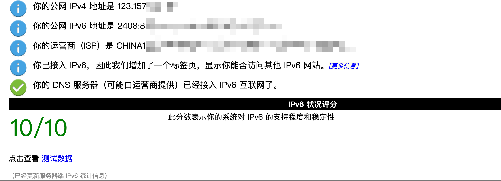
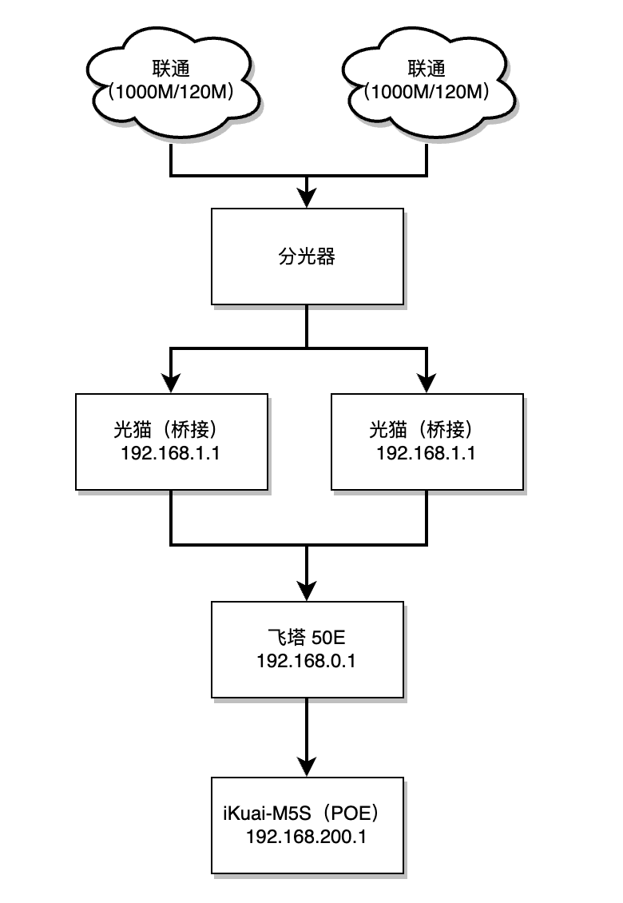
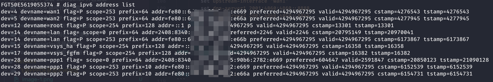
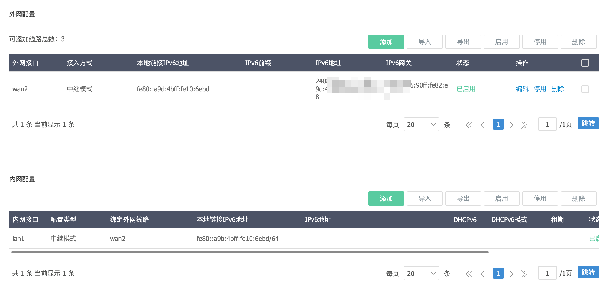

## 背景

最近从大佬手里收到一台50E的设备，之前一直想要家里搞一台飞塔的设备，这次愿望终于实现了。感谢：我的董教授

没啥其他背景，纯属是因为之前是用Ikuai进行拨号的，拿到了ipv6的地址。更换飞塔50E之后没有的ipv6的地址了，心里难受，所以要研究下。  

还有一个点：我的N1点心云如果有ipv6可以增加调度收益，哈哈哈哈。虽然一天3块钱～

## 操作流程

先上一张成功的图  


### 拓扑图

我的场景会稍微复杂一点，大部分应该不会有ikuai的那个设备，直接飞塔配置完成后即可正常使用了


### 飞塔50E配置

ipv6在飞塔的界面上配置几乎没有，因此需要SSH连接后在cli上进行配置

#### wan口配置

这里的配置都是单独ipv6的配置，并不是清空你之前的配置，你之前的配置不要去动！！！

```bash
config system interface
    edit "wan1"
        config ipv6
            set ip6-mode pppoe
            set ip6-allowaccess ping
            set dhcp6-prefix-delegation enable
            set dhcp6-prefix-hint ::/60
            set autoconf enable
        end
    next
end
```

#### lan口配置

这里的配置都是单独ipv6的配置，并不是清空你之前的配置，你之前的配置不要去动！！！

```bash
config system interface
    edit "internal"
        config ipv6
            set ip6-mode delegated
            set ip6-allowaccess ping
            set ip6-send-adv enable
            set ip6-manage-flag enable
            set ip6-upstream-interface "wan1"
            set ip6-subnet ::2/64
            set ip6-other-flag enable
            config ip6-delegated-prefix-list
                edit 1
                    set upstream-interface "wan1"
                    set autonomous-flag enable
                    set onlink-flag enable
                    set subnet ::/64
                next
            end
        end
    next
end
```

#### 配置防火墙

```bash
config firewall policy6
    edit 1
        set name "Default out"
        set srcintf "internal"
        set dstintf "wan1"
        set srcaddr "all"
        set dstaddr "all"
        set action accept
        set schedule "always"
        set service "ALL"
        set logtraffic all
    next
    edit 2
        set name "Allow ICMP in"
        set srcintf "wan1"
        set dstintf "internal"
        set srcaddr "all"
        set dstaddr "all"
        set action accept
        set schedule "always"
        set service "ALL_ICMP6"
        set logtraffic all
    next
end
```

#### 配置DHCPv6 服务器

```bash
config system dhcp6 server
    edit 1
        set interface "internal"
        set ip-mode delegated
        set upstream-interface "wan1"
        set dns-server1 2001:4860:4860::8888
        set dns-server2 2001:4860:4860::8844
    next
end
```

#### 检测是否有ipv6地址的获取

```bash
diag ipv6 address list
```



### ikuai 配置

没有ikuai的大佬可以忽略这一步，我的终端是接在ikuai下的。所以有这个步骤



ikuai的配置需要注意，必须开`中继模式`要不然的话，会通过自身的`fe`开头的地址去访问，这样的话会出现不是公网的ipv6地址的情况。

## 撒花🎉完工


参考以下文档：

- [blah.cloud](https://blah.cloud/networks/enabling-ipv6-dhcpv6-pd-pppoe-fortigate/)
