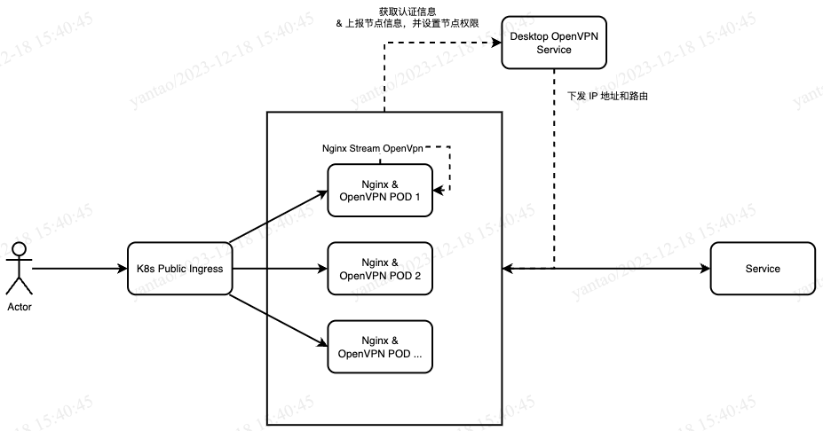
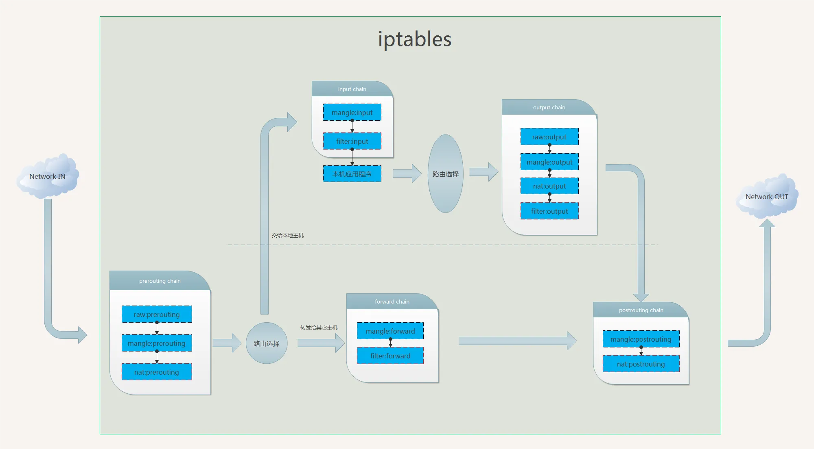
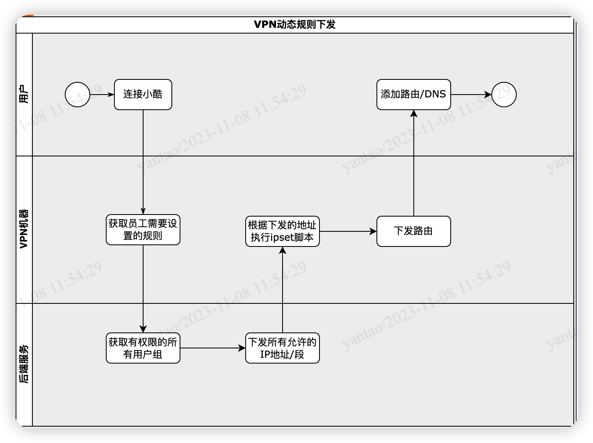

## 背景

现有的OpenVPN架构，不管是从扩容还是从性能上来说，都达到了一定的瓶颈，并且在IP扩容的层面上也非常的麻烦。

从整体的调研情况来看，大多数的情况下，员工都用不到“网关模式”，“NAT模式”足以满足业务的需求。因此决定，将大部分员工全部切换成“NAT模式”，研发自行决定是否需要“网关模式”；但是“NAT模式”也有缺点，也就是在服务测，记录的IP地址是POD节点的IP地址，无法定位到当前用户的IP信息。因此在做“NAT模式”的时候，需要考虑访问日志的记录。

## 名词介绍

### 网关模式（Gateway Mode）

在 OpenVPN 中，网关模式涉及确定 OpenVPN 服务器在网络中的位置和行为。当 OpenVPN 服务器配置为网关模式时，它被视为网络的网关，可以路由流量并将数据发送到其他网络。

特点：

- 路由行为：OpenVPN服务器以网关的形式工作，可以路由数据包，连接不同的网络。
- 可访问性：允许 OpenVPN 客户端之间进行通信，并且能够访问到 OpenVPN 服务器所在网络的其他设备。  
- 路由表设置：通常需要配置服务器的路由表以便正确路由流量。

### NAT 模式（Network Address Translation Mode）

NAT 模式涉及到 OpenVPN 服务器处理客户端流量的方式。在 NAT 模式下，OpenVPN 服务器通过网络地址转换（NAT）为连接到服务器的客户端提供网络访问。

特点：

- NAT转换：OpenVPN服务器使用NAT技术，将客户端的私有IP转换为服务器的公共IP，以便这些客户端可以访问 Internet 或其他网络资源。
- 连接与出口：所有客户端连接都被汇聚在服务器的出口IP下。

区别：

- 功能：网关模式涉及 OpenVPN 服务器的行为和位置，允许它作为网络的网关并进行路由。而 NAT 模式涉及 OpenVPN 服务器对于客户端流量的处理，使用网络地址转换技术。
- 使用场景：网关模式常用于连接不同网络，并允许客户端直接访问服务器所在网络中的其他设备。NAT 模式通常用于保护客户端的私有 IP，并提供对外的公共 IP，以访问 Internet 或其他公共资源

## 流量图



## 日志设计

在OpenVPN的POD上安装Nginx，通过Nginx的4层负载均衡（Stream），实现记录OpenVPN的日志请求。然后将Nginx的Log全部同步到日志服务器当中，作为后期的审计使用。

不过这里有一个考虑点，因为建立连接之后，是否还是会通过Nginx记录下所有的信息？这个点需要测试下。

日志有问题，就算经过 nginx 记录下来的也是四层的日志，没有 URI 信息

## 资料

### 主要思路

初始化一个 ubuntu 系统，然后将 openvpn 需要的一些依赖以及本身通过 apt-get 进行安装。  
完成安装之后通过准备好的配置文件拷贝到 POD 中  
启动一个空的 JAVA 项目，主要也适用于健康检测，当然这里也可以用 nginx 等等方式都可以，我这边这么做主要是方便

## 监控

采用 openvpn_exporter：https://github.com/patrickjahns/openvpn_exporter

```shell
wget https://it-service-cos.kujiale.com/openvpn_exporter-linux-386 && chmod +x openvpn_exporter-linux-386
nohup ./openvpn_exporter-linux-386 --status-file /var/log/openvpn/status.log --web.listen-address 0.0.0.0:8080 &
```

## 用户权限



| 名词 | 介绍 |
|--|--|
| ipset | ipset是Linux 内核提供的一个框架，它允许以自定义处理程序的形式实现各种与网络相关的操作。ipset 为数据包过滤、网络地址转换和端口转换提供了各种功能和操作，它们提供了引导数据包通过网络和禁止数据包到达网络中的敏感位置所需的功能。|
| iptables | iptables是一个用户空间实用程序，它允许系统管理员配置Linux 内核防火墙的IP 数据包过滤规则，实现为不同的Netfilter模块。过滤器组织在不同的表中，其中包含有关如何处理网络流量数据包的规则链。目前不同的内核模块和程序用于不同的协议； |



## 结尾

前面有讲过一部分的动态权限控制思路：[点击直达](https://yantao.wiki/post/openvpn/openvpn-%E5%8A%A8%E6%80%81%E6%9D%83%E9%99%90%E6%8E%A7%E5%88%B6%E6%80%9D%E8%B7%AF/openvpn/)
目前后端服务暂未开源，有兴趣的可以联系：849331499@qq.com 进行讨论交流
