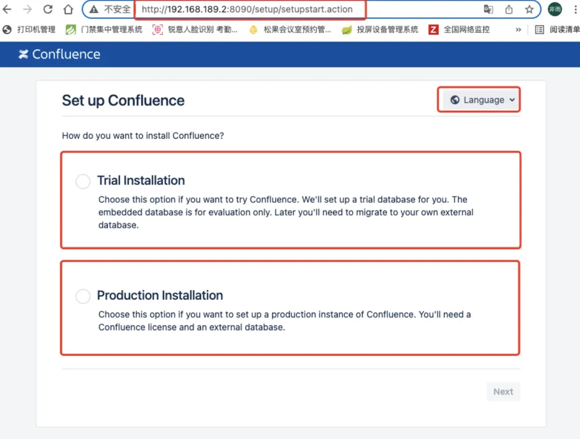
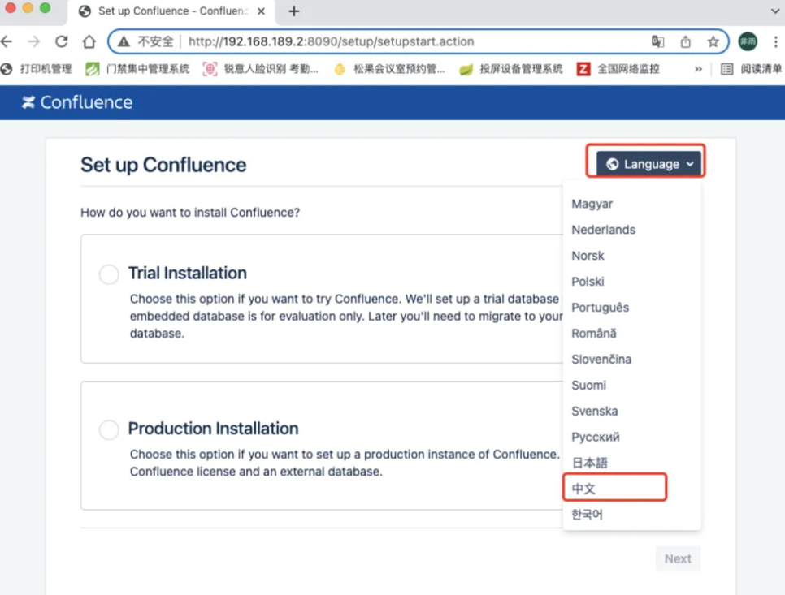
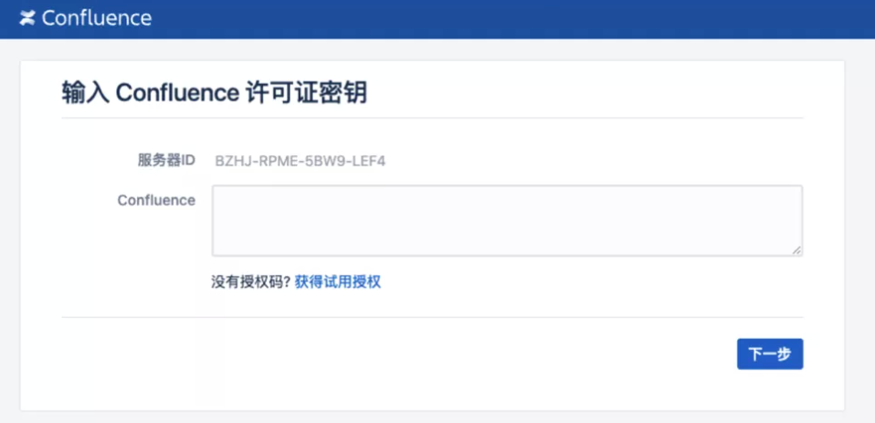
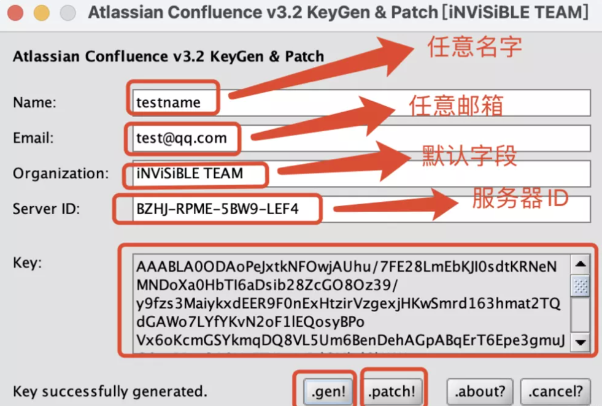
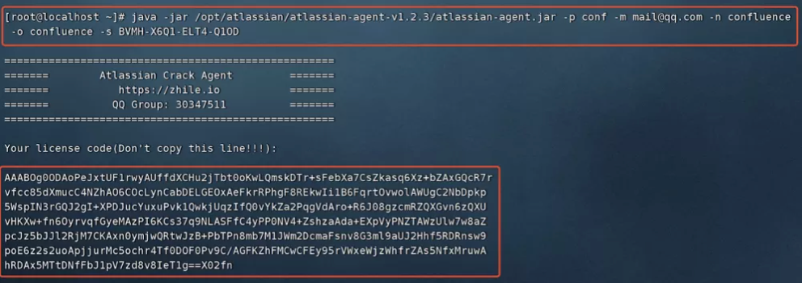

## 简介
Confluence是一个专业的企业知识管理与协同软件，也可以用于构建企业wiki。使用简单，但它强大的编辑和站点管理特征能够帮助团队成员之间共享信息、文档协作、集体讨论，信息推送。部署Confluence前，需确认服务器已部署Nginx+MySQL环境。

## 搭建环境
系统版本：CentOS Linux release 7.6.1810 (Core)  
confluence版本：Confluence 7.13.4（最新版本）   
Java版本：`java-11-openjdk-devel.x86_64`  
confluence解除工具：`confluence_keygen.jar`  
注：解除工具链接:  https://pan.baidu.com/s/1po6wouAIZPHbMG39oKKMVw  
提取码: guck  
Mysql-server版本：mysql-community-server.x86_64 0:5.7.22-1.el7​  
> mysql-connector-java版本：[mysql-connector-java-5.1.49](https://downloads.mysql.com/archives/get/p/3/file/mysql-connector-java-5.1.49.tar.gz)

注：以上插件下载地址如下截图可自选【系统版本】和【插件版本】，切记不要使用最新版本插件，由于官网文档说明不支持最新版，然后我特意亲测了一下确实不支持，最大支持mysql-connector-java-5.1.x 高于此版本都不支持，建议使用5.1.x版本插件，插件下载地址： https://downloads.mysql.com/archives/c-j/

关闭防火墙 `systemctl stop firewalld.service​`  
禁止防火墙开机自启 `systemctl disable firewalld.service​`  
关闭 selinux​ `sed -i ‘s/SELINUX=enforcing/SELINUX=disabled/g’ /etc/selinux/config`  
重启系统即可 `reboot`

## 安装数据库
### 下载mysql数据库社区yum源
```bash
wget  http://dev.mysql.com/get/mysql57-community-release-el7-10.noarch.rpm​
rpm -Uvh --force --nodeps mysql57-community-release-el7-10.noarch.rpm
yum -y install mysql-community-server
```

如果出现：  
Public key for mysql-community-common-5.7.42-1.el7.x86_64.rpm is not installed  
错误，那么就需要需要重新导入密钥了  
`rpm --import https://repo.mysql.com/RPM-GPG-KEY-mysql-2022`

```
### 修改配置文件
```bash
vi /etc/my.cnf
[mysqld]下添加如下字段
character-set-server=utf8mb4
collation-server=utf8mb4_bin
default-storage-engine=INNODB
max_allowed_packet=64M
innodb_log_file_size=512M
transaction-isolation=READ-COMMITTED
binlog_format=row
log_bin_trust_function_creators = 1
optimizer_switch = derived_merge=off
```
### 启动数据库
```bash
systemctl start mysqld
systemctl enable mysqld
```
### 创建数据库
```sql
create database confluence default character set utf8mb4 collate utf8mb4_bin;
grant all on confluence.* to 'confluence'@'%' identified by 'Confluence.123' with grant option;
grant all on confluence.* to 'confluence'@localhost identified by 'Confluence.123' with grant option;
flush privileges;
```
## 安装 Confluence
### 创建目录
```bash
mkdir /opt/atlassian/
```
### 下载资源文件
- confluence下载地址： [https://www.atlassian.com/zh/software/confluence/download-archives](https://www.atlassian.com/zh/software/confluence/download-archives)可以直接下载[7.13.4](https://www.atlassian.com/software/confluence/downloads/binary/atlassian-confluence-7.13.4-x64.bin)
- mysql插件下载地址： [https://downloads.mysql.com/archives/c-j/](https://downloads.mysql.com/archives/c-j/)
- atlassian-agent下载地址： [https://raw.githubusercontent.com/pmkol/atlassian-agent/master/atlassian-agent-v1.2.3.tar.gz](https://raw.githubusercontent.com/pmkol/atlassian-agent/master/atlassian-agent-v1.2.3.tar.gz)
### 解压文件
```bash
mv atlassian-confluence-7.13.5-x64.bin mysql-connector-java-5.1.49-bin.jar atlassian-agent-v1.2.3 /opt/atlassian/

tar xf mysql-connector-java-5.1.49.tar.gz
tar xf atlassian-agent-v1.2.3.tar.gz

```
### 开始安装
```bash
chmod +x /opt/atlassian/*
./atlassian-confluence-7.13.5-x64.bin
```
根据提示直接默认安装即可  

confluence安装到了`/opt/atlassian/confluence`和`/var/atlassian/application-data/confluence`目录下，并且confluence默认监听的端口是8090.一路默认安装即可！注意confluence的主要配置文件为`/opt/atlassian/confluence/conf/server.xml`，和jira类似。此server.xml相当于tomcat中的server.xml配置文件，如果要修改访问端口，可以这里修改。如果要修改confluence的数据目录，可以在安装的时候，在安装过程中进行更换（默认是`/var/atlassian/application-data/confluence`）

### 查看端口是否启动并被监听
```bash
lsof -i :8090
```
### 安装 mysql 驱动
```bash
cp /opt/atlassian/mysql-connector-java-5.1.49/mysql-connector-java-5.1.49-bin.jar /opt/atlassian/confluence/confluence/WEB-INF/lib/
```
### 安装JDK
```bash
yum install java-11-openjdk-devel.x86_64
```
### 安装 atlassian-agent
```bash
echo -e '\nexport JAVA_OPTS="-javaagent:/opt/atlassian/atlassian-agent-v1.2.3/atlassian-agent.jar ${JAVA_OPTS}"\n' >> /opt/atlassian/confluence/bin/setenv.sh
```
### 重启 Confluence
```bash
/etc/init.d/confluence restart
```

### Confluence 界面配置
#### 本地打开浏览器：http://localhost:8090

#### 修改语言为中文

#### 进行实例安装


#### 获取授权
方式一：保存服务器ID，安装JDK（windows或者Mac）
下载confluence解除工具。将服务器/opt/atlassian/confluence/confluence/WEB-INF/lib/目录下的
atlassian-extras-decoder-v2-3.4.1.jar下载到电脑上。下载文件前一定要先做备份，方便回退。运行解除程序，添加相关信息，先点击「.patch」选择下载下来的文件，然后如下截图一步一步添加字段，最后点击「.gen！」生成解除密钥，复制保存密钥。

方式二：保存服务器ID，安装JDK（linux）返回ssh命令行，使用atlassian-agent生成授权码
`java -jar /opt/atlassian/atlassian-agent-v1.2.3/atlassian-agent.jar -p conf -m  mail@qq.com -n confluence -o confluence -s BVMH-X6Q1-ELT4-Q1OD`

授权完成后进行数据库链接即可正常使用！
> 注：以上就彻底完成了confluence7.13.4的搭建部署，另外提醒一下这个版本不需要安装中文包，在设置里自带中文设置，直接更改即可。