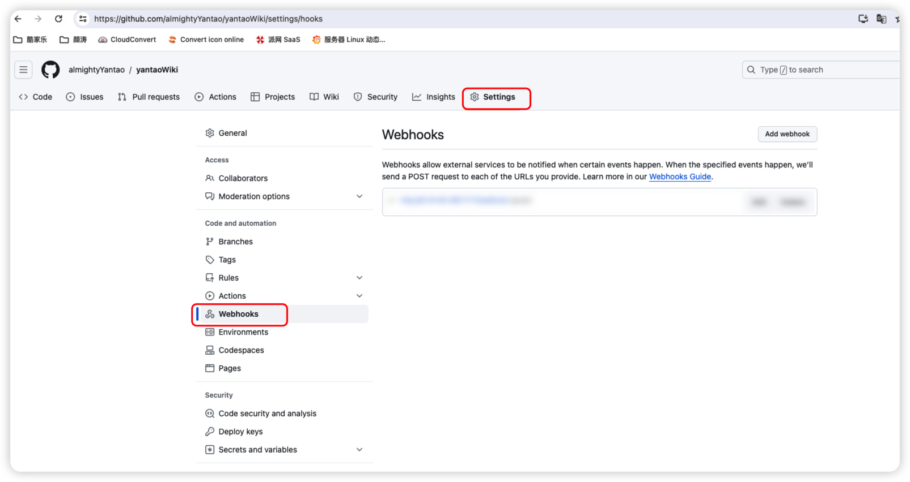
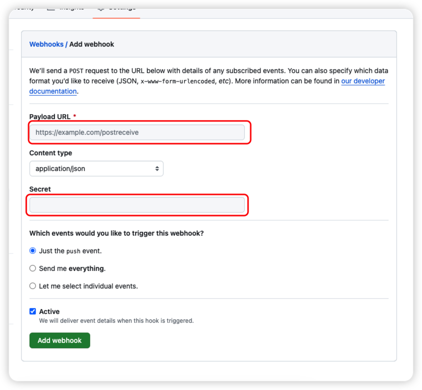
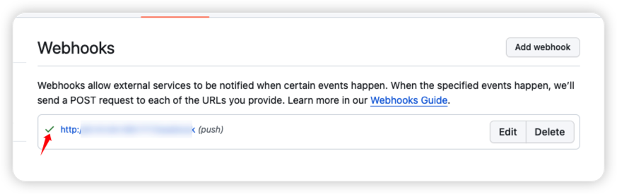
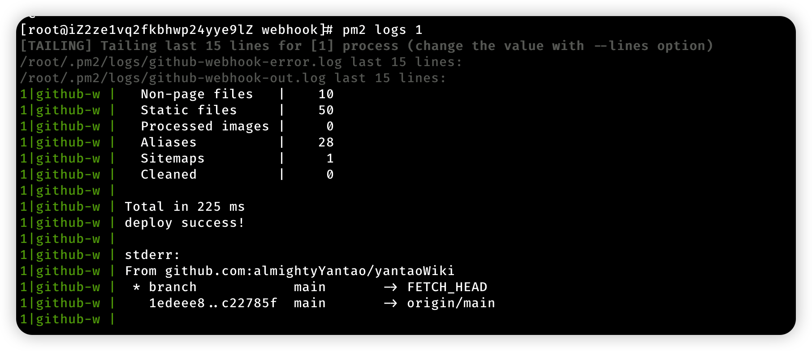

## 背景

自己写博客的时候部署一直是一个问题，每次写完都需要去服务器上手动拉一下代码，超级麻烦。为了更高的效率，搜了好多资料，最终选择了这个方案，按照目前来说，这个方案是我自身最喜欢以及最方便的了。当然如果你有更好的方案可以在下方留言，一起讨论下

## 方案

### 设置 Github 仓库

这里我不多做介绍，都是一些基操，网上一堆的教程

#### 新建仓库

新建仓库地址：https://github.com/new  
这是我的仓库地址：https://github.com/almightyYantao/yantaoWiki

#### 设置 SSH 密钥

地址：https://github.com/settings/keys  
生成密钥的方式：https://docs.github.com/en/authentication/connecting-to-github-with-ssh/generating-a-new-ssh-key-and-adding-it-to-the-ssh-agent

### 安装 node

我这边采用的是 nvm 直接安装，方便管理版本

```bash
yum install git -y
git clone https://github.com/cnpm/nvm.git ~/.nvm && cd ~/.nvm && git checkout `git describe --abbrev=0 --tags`
echo "source ~/.nvm/nvm.sh" >> ~/.bashrc
source ~/.bashrc
nvm install v18
npm install -g yarn
```

### 安装 PM2

```bash
npm install pm2@latest -g
pm2 -v
```

#### 新增 webhook 脚本

新增脚本文件：`github-webhook.js`

```js
var http = require('http')
var createHandler = require('github-webhook-handler')
var exec = require('child_process').exec
var handler = createHandler({ path: '/webhook', secret: 'mysecret' })

http.createServer(function (req, res) {
  handler(req, res, function (err) {
    res.statusCode = 404
    res.end('no such location')
  })
}).listen(7777)

console.log("github Hook Server running at http://0.0.0.0:7777/webhook");

handler.on('error', function (err) {
  console.error('Error:', err.message)
})

handler.on('push', function (event) {
  console.log('Received a push event for %s to %s',
    event.payload.repository.name,
    event.payload.ref)
    exec('sh ./hugo-deploy.sh', function (error, stdout, stderr) {
        if(error) {
            console.error('error:\n' + error);
            return;
        }
        console.log('stdout:\n' + stdout);
        console.log('stderr:\n' + stderr);
    });
})
```

新增部署文件：`hugo-deploy.sh`

```bash
#!/bin/bash

cd /var/www/html/yantaoWiki
git pull origin main
/var/www/html/yantaoWiki/hugo
atomic-algolia
echo "deploy success!"
exit 0
```

这两个文件记得放在一个目录下面  

#### 部署启动 webhook

```bash
npm install github-webhook-handler --save
pm2 start github-webhook.js
# 查看日志
pm2 logs 0
```

#### 设置 Github 的 webhook

点击`Add Webhook`

输入自己的域名或者 IP 地址，以及`Secret`

- `Payload URL`: 你自己的域名:7777/webhook
- `Content type`: application/json
- `Secret`: mysecret


### 安装 Nginx

```bash
rpm -ivh http://nginx.org/packages/centos/7/noarch/RPMS/nginx-release-centos-7-0.el7.ngx.noarch.rpm
yum install nginx
systemctl enable nginx
systemctl start nginx
```

#### 新增 hugo 的配置文件

```bash
mv /etc/nginx/conf.d/default.conf /etc/nginx/conf.d/default.conf.back
```

配置文件：hugo.conf

```conf
server {
    listen 80;
    server_name yantao.wiki;
    rewrite ^(.*)$ https://$host$1;
}

server {
     #HTTPS的默认访问端口443。
     #如果未在此处配置HTTPS的默认访问端口，可能会造成Nginx无法启动。
     listen 443 ssl;

     #填写证书绑定的域名
     server_name yantao.wiki;

     root /var/www/html/yantaoWiki/public;
     #填写证书文件绝对路径
     ssl_certificate /etc/nginx/conf.d/cert/yantao.wiki.pem;
     #填写证书私钥文件绝对路径
     ssl_certificate_key /etc/nginx/conf.d/cert/yantao.wiki.key;

     ssl_session_cache shared:SSL:1m;
     ssl_session_timeout 5m;

     #自定义设置使用的TLS协议的类型以及加密套件（以下为配置示例，请您自行评估是否需要配置）
     #TLS协议版本越高，HTTPS通信的安全性越高，但是相较于低版本TLS协议，高版本TLS协议对浏览器的兼容性较差。
     ssl_ciphers ECDHE-RSA-AES128-GCM-SHA256:ECDHE:ECDH:AES:HIGH:!NULL:!aNULL:!MD5:!ADH:!RC4;
     ssl_protocols TLSv1.1 TLSv1.2 TLSv1.3;

     #表示优先使用服务端加密套件。默认开启
     ssl_prefer_server_ciphers on;


    location / {
           index index.html index.htm;
    }
}
```

### 完成部署

这个时候你去访问你的网站应该都已经正常了，可以在本地直接`push`一下，然后刷新就可以看到网站的更新了  
如果没有更新的话，可以在这里看下 webhook 是否触发成功，成功的后可以在看下`pm2`的 log 日志，看看报错在哪里


